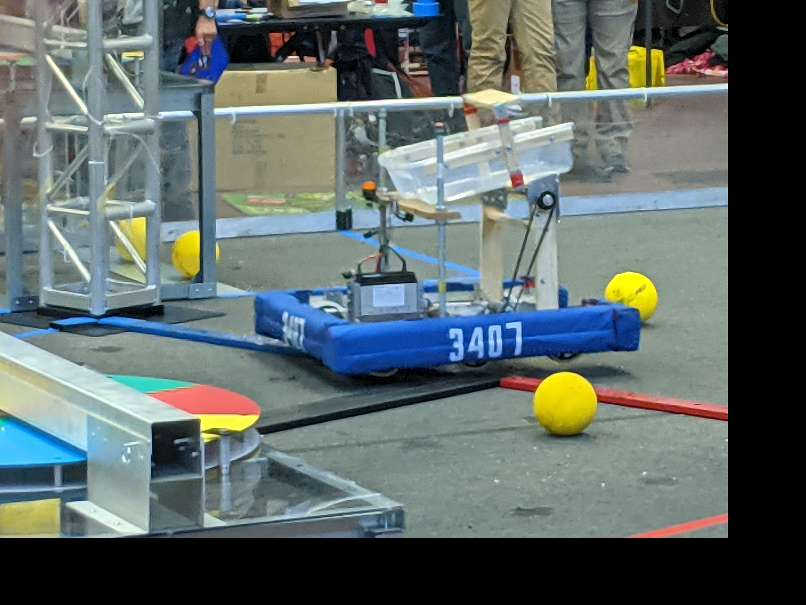

### MRI 2021

The Minnesota Robotics Invitational (MRI) is a yearly off-season event hosted in Roseville, MN.  
The details for the 2021 competition can be found here: [https://firebears.org/2021-minnesota-robotics-invitational/](https://firebears.org/2021-minnesota-robotics-invitational/)

### Photo Gallery

Competition Robot: Front View

---

Competition Robot: Side View

---

Setting up for the match

---

On the Field, Ready to go!

---

Strategy meeting before the match

---

Mid Match, Mid Field

---

Driver at the wheel...er, I mean joystick

